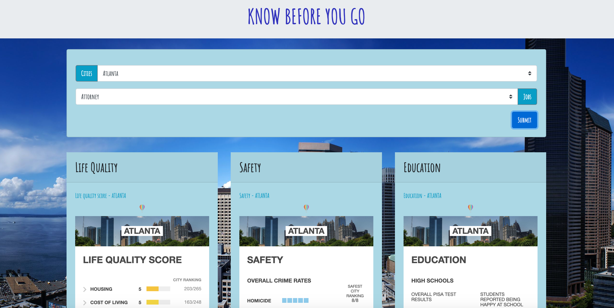
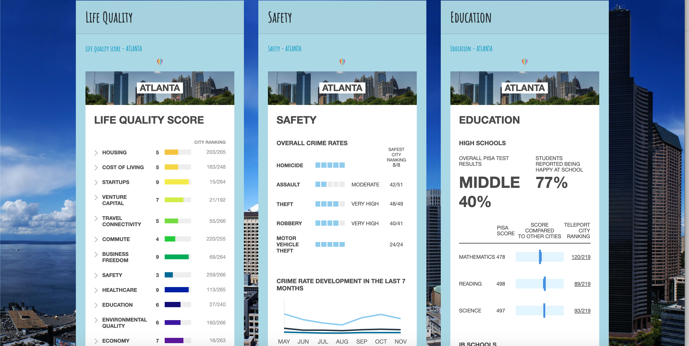
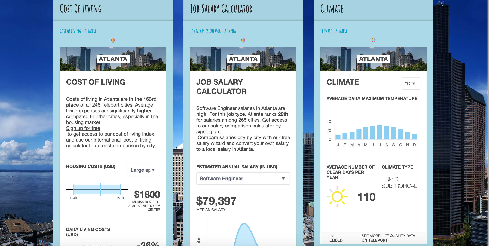
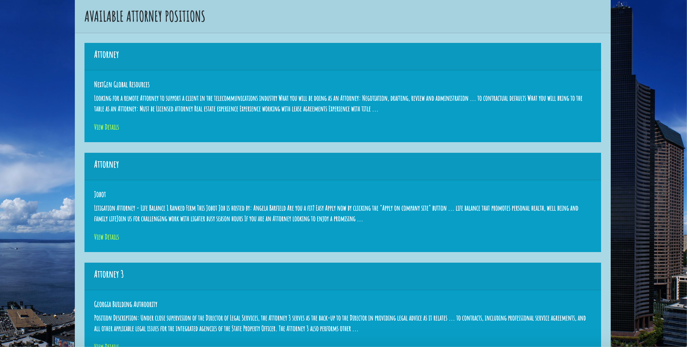

# know-before-you-go

For our first project we were to use at least two API’s to create a user-friendly site. Using the two API’s we choose from; we created a site that would provide users the ability to search for jobs in cities that meet all their life expectations. What is unique about our site is that you will find all this information in one place as opposed to having to search for it in various sites. Using our site users can make an educated decision of where they would move for a specific job they are interested in.  

# User story: 

AS A competitor seeking new job opportunities.
I WANT TO find a city that meets my expectations for quality of life. 
SO THAT I can enjoy a healthy work life balance

# Website images

# Git Hub 

https://github.com/Kmcateer926/know-before-you-go

# Deployed

https://kmcateer926.github.io/know-before-you-go/ 

# Installation

* Created a git repository
* Created and HTML, CSS and JavaScript files. 
* What we used to create our page:
* Document Object Model (DOM)
* Bootstrap
* Functions Calls
* Variable Created
* Console logging
* Event listeners
* For Loops
* Set Attributes
* AJAX Calls
* API’S USED:
* Teleport API
* Adzuna API

# Credits

•	Harshanan Saddanathan: https://github.com/hsaddanathan
•	Kevin McAteer: https://github.com/Kmcateer926
•	Jenna LaFrancois: https://github.com/jennalala
•	Estefania Lupo: https://github.com/lain7891

# License

Used MIT License for this assignment. 
